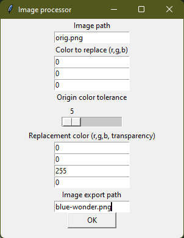

# image-transparentor
### python script to replace color scopes with another color or make them transparent!


## Executable Installation / How to use (Windows olny)
Download the executeable version from this repository and run it

## Script Installation / How to use
### Install and/or open Thonny
Get Thonny: [Thonny](https://thonny.org/)
### Install numpy & PIL (for GUI version also tkinter)
You can do that via Package Manager built in to Thonny
### Run Script
Well, thats as easy as to open the script in Thonny, setting the setting strings to your wishes and hit the run button.

### Compile the script yourself
You can do that with pyinstaller (get it with pip)

Then open a system shell in Thonny and run the following command:
```cmd
pyinstaller --noconsole --onefile <path to the downloaded script>
```
